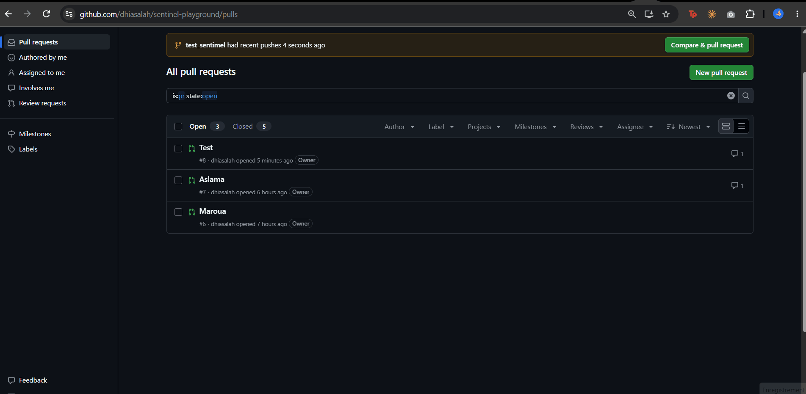

# Sentinel

Sentinel is a GitHub App that reviews pull requests for security issues. When a PR is opened or updated, it
checks out the PR's code, scans it with Semgrep, has an LLM group and explain the findings, and posts a
security report as a comment on the PR.



The core design rule: **scanners detect, the AI reasons.** Semgrep decides *what* is wrong. The LLM only
groups findings, explains them and suggests fixes, under strict guardrails.

## How it works

1. **Webhook API** (`apps/api`, FastAPI): receives GitHub `pull_request` events and verifies the
   HMAC SHA-256 signature. It drops replayed deliveries (de-duplicated on a hash of the body, stored in Redis
   for 24 h) and pushes a small job (`repo`, `pr`, `head_sha`, `installation_id`) onto a Redis list. It never
   runs a scan itself.
2. **Queue** (Redis): jobs move from `sentinel:jobs` to `sentinel:jobs:processing` with `BLMOVE`, so a crash
   doesn't lose a job. Failed jobs go to `sentinel:jobs:dead`.
3. **Worker** (`agents/sentinel/worker.py`): for each job it:
   - signs a short-lived **RS256 App JWT** and exchanges it for an **installation token downscoped** to one
     repo and one permission (`contents: read` for the checkout, `pull_requests: write` for the comment);
   - does a **shallow, detached checkout** of the exact commit into a temp dir. The repo and SHA are
     validated first, symlinks are disabled, the token is passed via an HTTP header (never in the URL), and
     the dir is deleted afterwards;
   - runs **Semgrep in Docker** with the code mounted read-only and metrics off;
   - sends findings to the **LLM triage** step;
   - posts or updates **one** report comment. Its own old comment is found by author + marker, so a fake
     comment carrying the marker is ignored.
4. **CLI** (`python -m sentinel scan <dir>`): runs the same scan + triage on a local folder, with text or
   JSON output. It exits with code 1 when an issue is at or above `--fail-on` severity, so it can be used in
   CI.

## AI security guardrails

- **LLM router**: Gemini first, Groq as a fallback when a provider is unavailable or rate-limited.
- **Untrusted data fencing**: repo code goes inside `<untrusted-RANDOM>` tags with a fresh random tag per
  scan, so the PR can't close the fence. The system prompt says content inside them is data, not
  instructions.
- **Strict output schema**: the answer must be JSON that passes Pydantic validation. Every finding must be
  used exactly once, with no unknown IDs, so the LLM can't silently drop a finding.
- **Policy layer**: the AI can't lower severity below what the scanner reported. "False positive" verdicts
  and code that addresses the AI (a possible prompt injection) are flagged "needs human review" instead of
  being hidden.
- **Output escaping**: all AI and repo text in the PR comment is Markdown/HTML-escaped. Links, `@mentions`
  and `#refs` are neutralised, and length is capped, so a PR can't make the bot post phishing links or ping
  people.

## Tech stack

| Area | Tech |
|---|---|
| Language | Python 3.13 |
| API | FastAPI, Uvicorn, pydantic-settings |
| Queue | Redis 8 |
| GitHub | GitHub App, webhooks, REST API via `httpx`, PyJWT (RS256) |
| Scanning | Semgrep (`p/python` rules), run via Docker |
| LLMs | Google Gemini (`google-genai`), Groq |
| Validation | Pydantic v2 |
| Containers | Docker, Docker Compose (non-root API image with healthcheck) |
| Tests | pytest, fakeredis, monkeypatched `httpx` (no network) |

Planned (see `sentinel-project.md`): more scanners (Trivy, gitleaks, Checkov) behind MCP servers, LangGraph
multi-agent flow, sandboxed fix testing, a Next.js dashboard, and k3s deployment via Terraform, Helm and
ArgoCD.

## Repo layout

```
apps/api/      FastAPI webhook gateway + Dockerfile
agents/        sentinel package: CLI, worker, GitHub, scanners, LLM router, triage, policy
evals/         deliberately vulnerable demo apps (incl. a prompt-injection one)
compose.yaml   API + Redis for local runs
```

## Run it locally (Windows / PowerShell)

**Requirements:** Python 3.13, Docker Desktop (running), Git, a Gemini and/or Groq API key.

1. **Configure secrets.** Copy the template and fill in the values. `.env` and `*.pem` are git-ignored.
   ```powershell
   Copy-Item .env.example .env
   ```

2. **Start the API + Redis.**
   ```powershell
   docker compose up -d --build
   curl.exe http://127.0.0.1:8000/ready     # {"status":"ready"}
   ```

3. **Install the agents package.**
   ```powershell
   cd agents
   python -m venv .venv
   .\.venv\Scripts\Activate.ps1
   pip install -r requirements-dev.txt
   ```

4. **Scan a local folder** (no GitHub needed):
   ```powershell
   python -m sentinel scan ..\evals\vulnerable-apps\flask-demo
   ```

5. **Run the worker** (needs the GitHub App settings in `.env`):
   ```powershell
   python -m sentinel.worker
   ```
   For real PR events, GitHub must be able to reach your API. Forward the webhook to
   `http://127.0.0.1:8000/webhooks/github` with a tunnel (e.g. smee.io or ngrok). The App needs
   **Contents: read** and **Pull requests: write**, and must subscribe to **Pull request** events.

6. **Run the tests.**
   ```powershell
   pytest -q                     # in agents/
   cd ..\apps\api; pytest -q     # API tests
   ```
